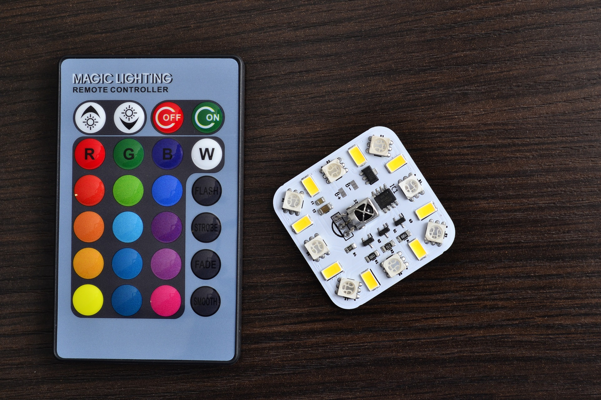
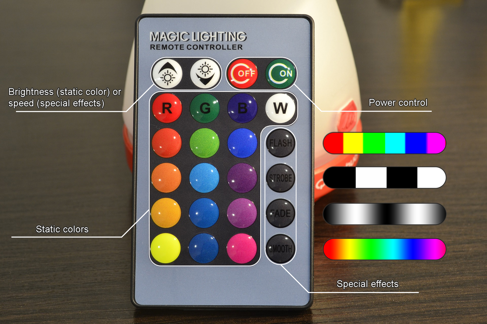
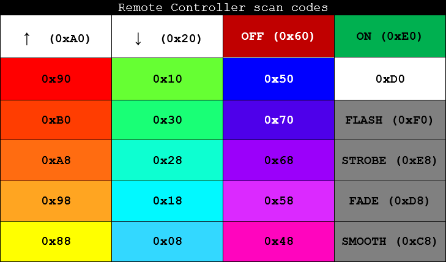
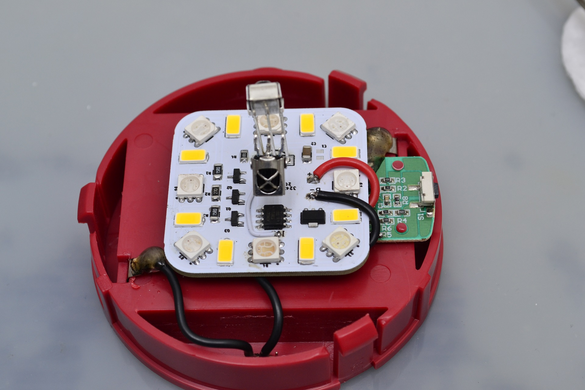
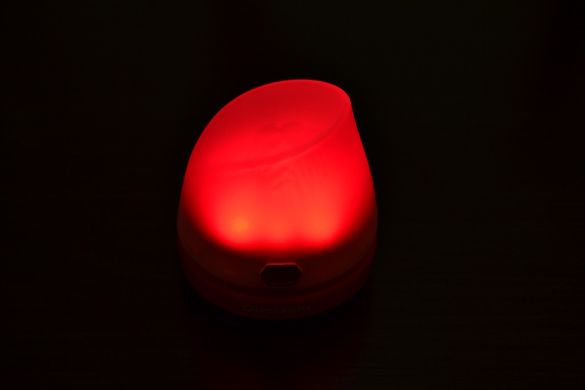
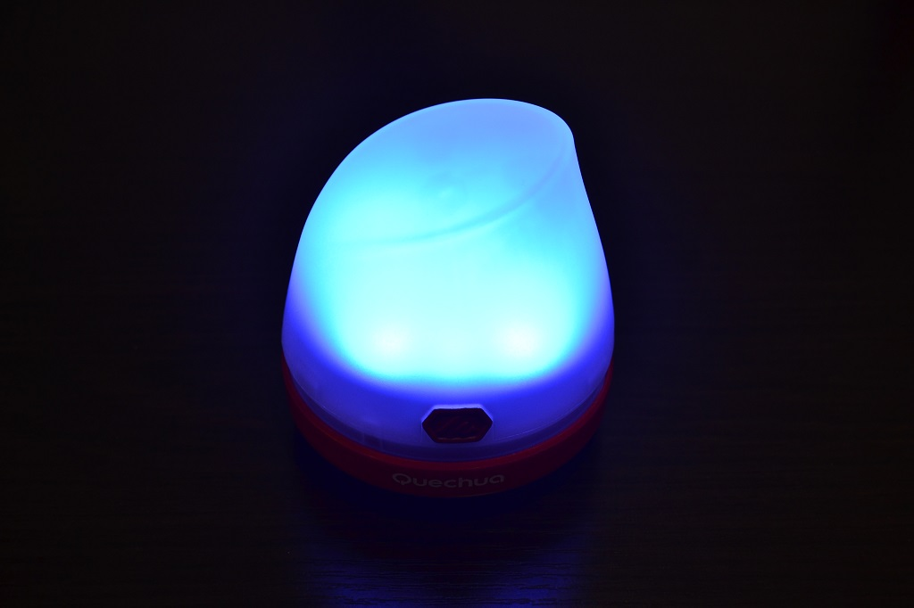
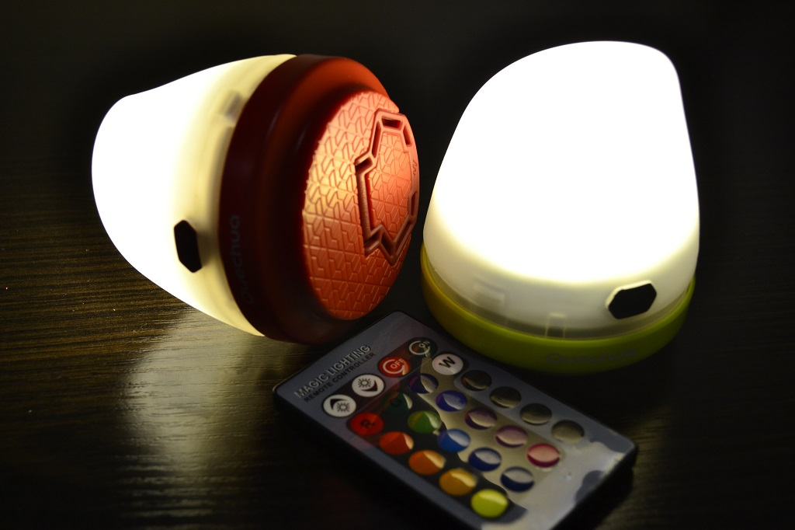
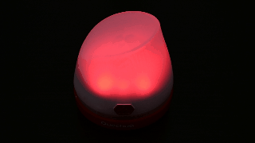
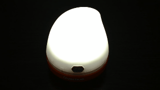
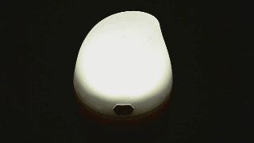

# Attiny13A based remote control RGBW module

# Features

* 4 independent software PWM channel to control RGBW led
* Works with cheap 24-key IR remote controller (NEC protocol)
* 16 static colors and 4 special effects
* 5 brightness levels (for static colors) and variable special effects speed
* Constant current on white leds (up to 350mA gives about 150 lumen at max brightness)
* Power ON/OFF feature
* Power consumption in OFF mode is less than 0.8mA (depends on IR receiver)
* Supply voltage: 3V to 6V (single Li-ion, 3xLR06, USB)

# Remote controller

||
|:---:|
||

# Usage example

## Quechua BL40 camping lamp modification

Buy link: [Quechua BL40](https://www.decathlon.com/products/camping-and-hiking-lamp-bl-40)

Remove the main LED and connect your RGBW module instead. Also you have to replace a current-limiting resistor with Schottky diode (SS54 or SS36) to get the switch button properly working.
You can wire multiple IR receiver modules in parallel to achieve wide viewing angle, but keep in mind that this increases power consumption in OFF mode.

### Showcase

|||||
|:---:|:---:|:---:|:---:|

#### Special effects

|**Flash**|**Smooth**|
|:-------:|:--------:|
|||
|**Strobe**|**Fade**|
|||

# Ways to support me

If you liked my firmware, feel free to say "Thank you" :blush:

|PayPal|Yandex.Money|
|:----:|:----------:|
|||