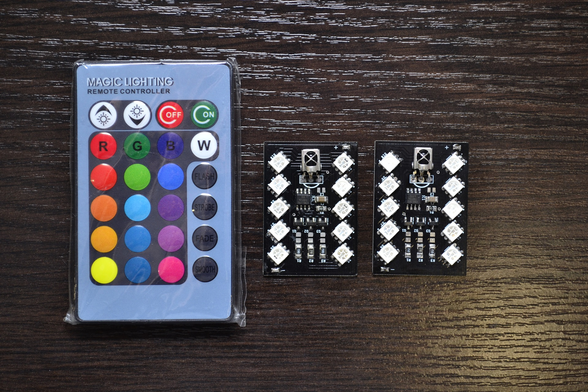

# Attiny13A based remote control RGB module

# Features

* 3 independent software PWM channel to control RGB led
* Works with cheap 24-key IR remote controller (NEC protocol)
* 16 static colors and 4 special effects
* 5 brightness levels (for static colors) and variable special effects speed
* Power ON/OFF feature
* Power consumption in OFF mode is less than 0.8mA (depends on IR receiver)
* Supply voltage: 3V to 6V (single Li-ion, 3xLR06, USB)
* Size: 868 bytes

# Remote controller

||
|:---:|
||

### Showcase

|||||
|:---:|:---:|:---:|:---:|

#### Special effects

|**Flash**|**Smooth**|
|:-------:|:--------:|
|||
|**Strobe**|**Fade**|
|||
