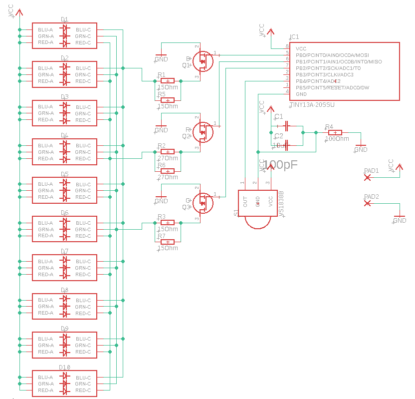
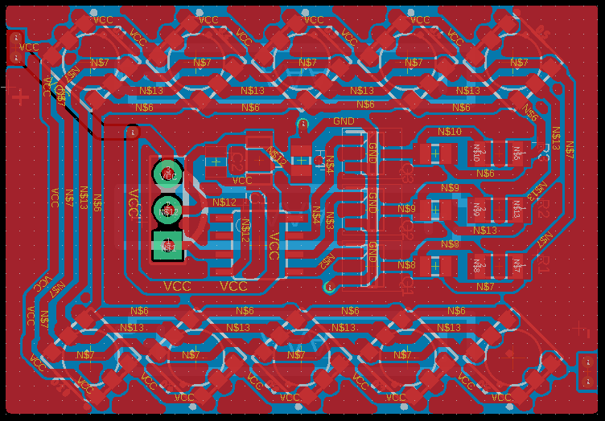

# Circuit and board

|||
|:---:|:---:|

Made in EAGLE 9.4.2

# Bill Of Materials

|**Item**|**Quantity**|**Description**|
|:------:|:----------:|:--------------|
|D*|10|5050 RGB LED|
|Q*|3|SOT-23 N-channel MOSFET with Imax > 100mA (AO3400, IRLML2502TR)|
|R1, R3|2|15 Ohms 1206 resistor|
|R2|1|27 Ohms 1206 resistor|
|R4|1|100 Ohms 0805 resistor|
|C1|1|10pF 0805 capacitor|
|C2|1|10uF 1206 capacitor|
|U2|1|IR receiver (VS1838B, TSOP4838 or similar)|
|IC1|1|ATTINY13-20SSU|
